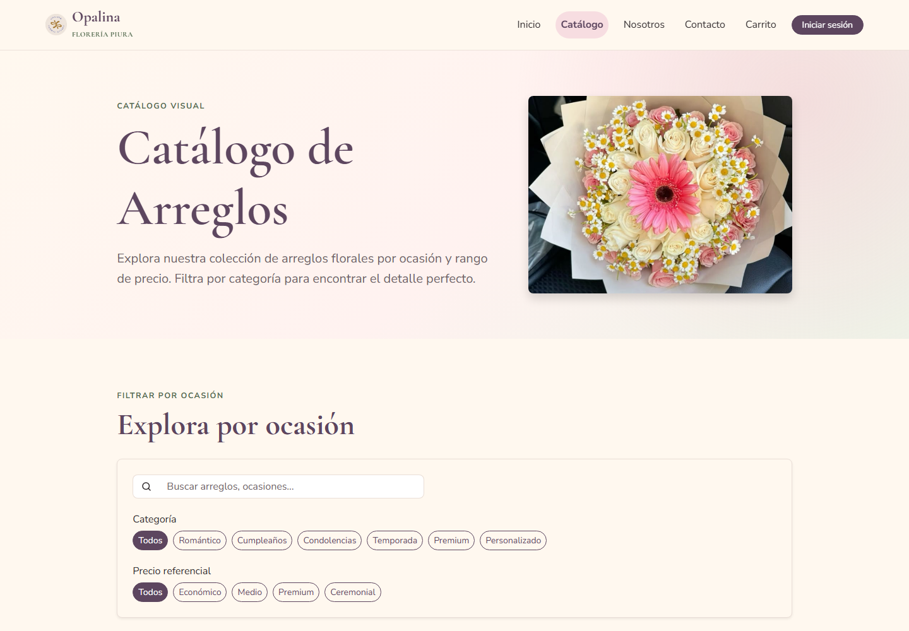
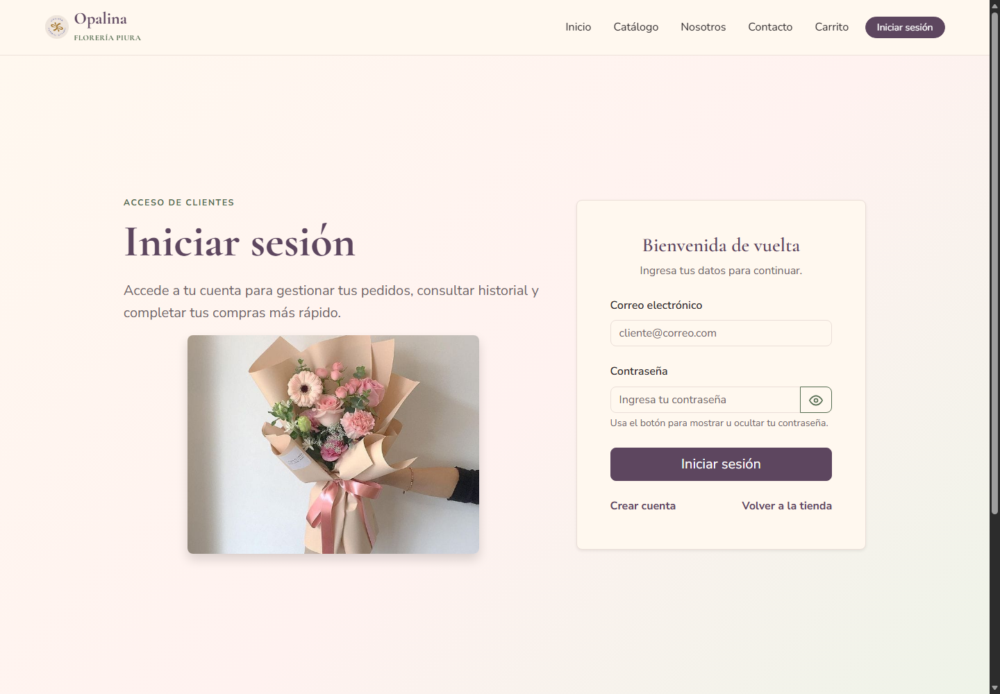
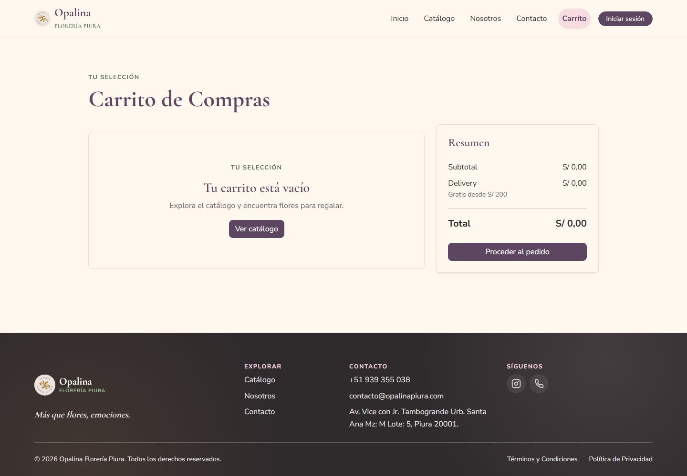

# Opalina Florería Piura — Avance 2

Aplicación web prototipo que transforma el frontend de Avance 1 en una aplicación dinámica con Spring Boot, Spring Web MVC, Thymeleaf y Bootstrap. La arquitectura sigue MVC y almacena los datos temporalmente en memoria. Esta etapa no utiliza base de datos.

## 3.1.1 Configuración del proyecto Spring Boot

### Tecnologías y dependencias principales

| Tecnología o dependencia | Uso en el proyecto |
| --- | --- |
| Java 21 | Lenguaje y versión de compilación configurada en Maven. |
| Spring Boot 4.1.1 | Configuración y ejecución de la aplicación. |
| `spring-boot-starter-webmvc` | Controladores web, rutas HTTP y servidor integrado. |
| `spring-boot-starter-thymeleaf` | Renderizado de plantillas HTML del lado del servidor. |
| `spring-boot-starter-validation` | Validación de formularios y datos recibidos por la API. |
| Bootstrap 5.3.8 | Diseño responsive y componentes visuales; se carga desde CDN en el fragmento común de cabecera. |
| `spring-boot-devtools` | Herramientas de desarrollo, dependencia opcional y de ejecución. |
| Starters de prueba de Spring Boot | Dependencias de alcance `test` disponibles para pruebas automatizadas. |

Las dependencias Java y versiones se declaran en [`pom.xml`](pom.xml). Bootstrap no se agrega como dependencia Maven: su CSS y su JavaScript se incluyen desde CDN en `templates/fragments/head.html` y `templates/fragments/scripts.html`.

### Ejecución

Desde la raíz del proyecto:

```powershell
.\mvnw.cmd spring-boot:run
```

La aplicación inicia en `http://localhost:8080`.

### Datos en memoria

El perfil predeterminado es `memory` (`spring.profiles.default=memory`). Las implementaciones `InMemory*Repository` almacenan los datos con listas en memoria y `DataInitializer` carga los datos de demostración al iniciar. No se configura ni se conecta una base de datos en este avance; los cambios se pierden al reiniciar la aplicación.

## 3.1.2 Arquitectura MVC del proyecto

### Estructura principal

```text
opalina/
├── pom.xml
├── mvnw / mvnw.cmd
├── src/
│   └── main/
│       ├── java/com/floral/opalina/
│       │   ├── config/          # Configuración web y carga de datos de demostración
│       │   ├── controller/      # Controladores MVC y API REST
│       │   │   └── api/
│       │   ├── dto/              # Datos de entrada y formularios
│       │   ├── exception/       # Manejo de errores y recursos no encontrados
│       │   ├── model/            # Entidades del dominio y enumeraciones
│       │   ├── repository/       # Contratos de acceso a datos
│       │   │   └── memory/       # Implementaciones en memoria con ArrayList
│       │   ├── service/          # Reglas de negocio y coordinación de procesos
│       │   └── session/          # Estado de usuario y carrito de la sesión
│       └── resources/
│           ├── templates/        # Vistas Thymeleaf organizadas por sección
│           ├── static/           # CSS, JavaScript, imágenes y recursos estáticos
│           └── application.properties
└── docs/
    └── referencia-frontend/     # Copia de referencia del frontend de Avance 1
```

### Responsabilidad de cada capa

| Capa | Paquete o ubicación | Responsabilidad |
| --- | --- | --- |
| Modelo | `model/` | Representa productos, clientes, pedidos, entregas y sus estados. |
| Controlador | `controller/` | Recibe solicitudes HTTP, coordina servicios y selecciona la vista o respuesta REST. |
| Servicio | `service/` | Aplica reglas de negocio para catálogo, carrito, cuentas, pedidos y reportes. |
| Repositorio | `repository/` | Define operaciones de consulta y guardado; `repository/memory/` las implementa usando colecciones en memoria. |
| Vista | `resources/templates/` | Presenta páginas HTML procesadas por Thymeleaf. |
| Recursos estáticos | `resources/static/` | Contiene Bootstrap personalizado, estilos, JavaScript e imágenes servidos directamente. |
| DTO y formularios | `dto/` | Recibe y valida los datos de formularios y solicitudes de API. |

Flujo web: **solicitud → controlador → servicio → repositorio → modelo → servicio/controlador → plantilla Thymeleaf**. Los controladores de `controller/api/` exponen respuestas JSON para operaciones REST.

## 3.1.3 Implementación de Spring Web

### Rutas de páginas y formularios

| Método y ruta | Controlador | Función |
| --- | --- | --- |
| `GET /` | `HomeController` | Muestra la página de inicio y arreglos destacados. |
| `GET /nosotros`, `GET /contacto`, `POST /contacto` | `HomeController` | Presenta información y recibe el formulario de contacto. |
| `GET /catalogo`, `GET /productos/{id}` | `CatalogoController` | Filtra el catálogo por búsqueda, categoría y precio; muestra el detalle de un arreglo. |
| `GET/POST /login`, `POST /logout`, `GET/POST /registro` | `AuthController` | Presenta formularios de acceso y registro, inicia y cierra la sesión de demostración. |
| `GET /carrito` | `CarritoController` | Muestra los productos del carrito y sus importes. |
| `POST /carrito/items`, `POST /carrito/items/{productoId}/cantidad`, `POST /carrito/items/{productoId}/eliminar` | `CarritoController` | Agrega artículos, ajusta sus unidades o los quita del carrito. |
| `GET /pedido`, `POST /pedido/confirmar` | `PedidoController` | Presenta el checkout, valida la entrega y confirma un pedido. |
| `GET /confirmacion` | `PedidoController` | Redirige al historial de pedidos por compatibilidad con el frontend de referencia. |
| `GET/POST /cuenta/perfil` | `CuentaController` | Muestra y actualiza los datos del perfil del cliente autenticado. |
| `GET /cuenta/pedidos`, `GET /cuenta/pedidos/{id}` | `CuentaController` | Muestra el historial y el detalle de pedidos del cliente. |
| `GET /admin`, `GET /admin/pedidos`, `GET /admin/pedidos/{id}`, `POST /admin/pedidos/{id}/estado` | `AdminPedidoController` | Redirige al panel, lista y detalla pedidos, y cambia su estado. |
| `GET/POST /admin/productos`, `GET/POST /admin/productos/{id}`, `POST /admin/productos/{id}/disponibilidad` | `AdminProductoController` | Administra el catálogo y la disponibilidad de productos. |
| `GET /admin/clientes` | `AdminClienteController` | Consulta y ordena el resumen de clientes y sus compras. |
| `GET/POST /admin/configuracion` | `AdminConfiguracionController` | Consulta y actualiza la configuración de la tienda. |
| `GET /admin/reportes` | `AdminReporteController` | Muestra métricas de pedidos y productos vendidos, opcionalmente filtradas por estado. |
| `GET /terminos`, `GET /privacidad` | `LegalController` | Muestra las páginas legales. |

### Rutas REST principales

| Método y ruta | Controlador | Función |
| --- | --- | --- |
| `GET /api/productos`, `GET /api/productos/{id}` | `ProductoRestController` | Lista y consulta productos; admite filtros opcionales en la lista. |
| `POST /api/productos`, `PUT /api/productos/{id}`, `DELETE /api/productos/{id}` | `ProductoRestController` | Crea, actualiza y elimina productos con cuerpos JSON validados. |
| `GET /api/pedidos`, `GET /api/pedidos/{id}` | `PedidoRestController` | Lista pedidos (con filtro opcional por estado) y consulta su detalle. |
| `POST /api/pedidos`, `PATCH /api/pedidos/{id}/estado` | `PedidoRestController` | Crea un pedido y cambia su estado. |
| `GET /api/clientes`, `GET /api/clientes/{id}` | `ClienteRestController` | Lista clientes y consulta el resumen de compras de uno. |

## 3.1.4 Integración con Thymeleaf

Las vistas se encuentran en `src/main/resources/templates/`. Los controladores agregan al modelo los datos que cada página presenta. Thymeleaf conecta ese modelo con el HTML mediante atributos `th:*`, como iteraciones de productos y pedidos, enlaces de rutas, formularios y mensajes. La cabecera, navegación, pie de página, mensajes y carga de scripts se reutilizan desde `templates/fragments/`.

| Plantilla | Controlador y datos principales recibidos |
| --- | --- |
| `public/index.html` | `HomeController`; lista `destacados` para las tarjetas de inicio. |
| `public/catalogo.html` | `CatalogoController`; recibe `productos`, `categorias` y los valores seleccionados de búsqueda y filtros. |
| `public/producto.html` | `CatalogoController`; recibe el `producto` consultado por identificador. |
| `public/nosotros.html`, `legal/terminos.html`, `legal/privacidad.html` | Páginas informativas con contenido de plantilla. |
| `public/contacto.html` | `HomeController`; recibe `contactoForm`, errores de validación y mensajes. |
| `auth/login.html`, `auth/registro.html` | `AuthController`; reciben sus formularios, errores y destino de retorno cuando corresponda. |
| `tienda/carrito.html` | `CarritoController`; recibe `items`, `subtotal`, `delivery` y `total`. |
| `tienda/pedido.html` | `PedidoController`; recibe `checkoutForm`, artículos, importes, modalidades, medios de pago y el pedido confirmado si existe. |
| `cuenta/perfil.html` | `CuentaController`; recibe el cliente, iniciales y `perfilForm`. |
| `cuenta/pedidos.html`, `cuenta/pedido-detalle.html` | `CuentaController`; reciben pedidos del cliente, filtros y datos del detalle. |
| `admin/pedidos.html`, `admin/pedido-detalle.html` | `AdminPedidoController`; reciben pedidos, estados, métricas y detalle del cliente. |
| `admin/productos.html`, `admin/producto-detalle.html` | `AdminProductoController`; reciben productos, filtros, métricas y formularios de edición. |
| `admin/clientes.html` | `AdminClienteController`; recibe resultados de búsqueda, orden y resumen de compras. |
| `admin/configuracion.html` | `AdminConfiguracionController`; recibe el formulario de configuración de la tienda. |
| `admin/reportes.html` | `AdminReporteController`; recibe el resumen, productos vendidos y filtro por estado. |

### Capturas para la exposición

Las siguientes capturas muestran plantillas renderizadas por la aplicación Spring Boot ejecutándose con el perfil `memory`:

#### Inicio — `GET /`


#### Catálogo — `GET /catalogo`



#### Acceso — `GET /login`



#### Carrito — `GET /carrito`



La versión estática usada como base del Avance 1 se conserva como material de referencia en `docs/referencia-frontend/`; las páginas dinámicas del Avance 2 son las plantillas Thymeleaf de `src/main/resources/templates/`.
